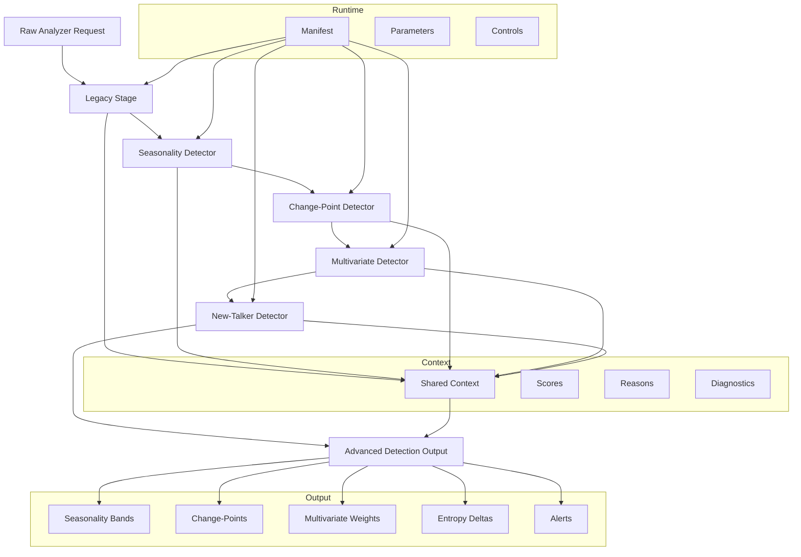

# Aman: macOS Network & Security Auditor

## Overview

Aman is a macOS Network & Security Auditor that merges a Swift-based audit engine with a Python-driven analytics layer. It performs system integrity checks, network exposure assessments, and behavior-based anomaly detection — all locally on-device. The auditor’s dual-layer design ensures detailed results without compromising privacy, making it a comprehensive tool for self-contained macOS security evaluation.

## Core Features

Aman combines structural system auditing with live network intelligence. It checks and validates configuration settings across **FileVault**, **SIP**, **Lockdown Mode**, **Gatekeeper**, and numerous other controls derived from CIS Benchmarks. The outcome of every scan is categorized under *Pass*, *Review*, or *Action*, accompanied by contextual explanations and one-click remediation references.

Beyond system auditing, Aman includes a real-time network module. It maps interfaces, discovers connected devices, and identifies exposed services through lightweight local probing. Network scans, topology exports, and consent-based intranet analysis form the backbone of its diagnostic capability. All actions operate under explicit user approval, ensuring compliance with privacy standards.

### Integrated Components

* **Configuration Auditing** - Performs comprehensive macOS configuration analysis, detecting deviations from security best practices.
* **Network Mapping** - Scans local interfaces, collects connection data, and generates visualized network topology exports.
* **Certificate and Hash Tools** - Built-in SSL certificate lookup and hash generator utilities powered by CryptoSwift.
* **Remediation Catalog** - Provides step-by-step mitigation guidance tied directly to detected issues.

## Advanced Detection Framework

Aman’s advanced detection engine, located in `Support/analyzer_core`, operates as a modular pipeline defined by `analyzer_pipeline.yaml`. This framework combines multiple detection models into a sequential process, each contributing specialized insights to a shared context.

### Detection Phases

1. **Legacy Stage** – Baseline heuristic evaluation using rule-based filters.
2. **Seasonality Detector** – Analyzes traffic patterns over time to determine normal periodic behavior.
3. **Change-Point Detector** – Identifies abrupt statistical shifts in network flow or packet rate distributions.
4. **Multivariate Detector** – Correlates data across multiple dimensions (throughput, latency, packet entropy) to detect composite deviations.
5. **New-Talker Detector** – Recognizes first-seen hosts or services, measuring entropy deltas and novelty within recent activity.

Each stage writes diagnostic data — scores, reasons, and statistical metrics — into a shared memory context, forming a cohesive analytical model. This produces an aggregated structure labeled `advancedDetection`. By applying rolling windows and vectorized operations, Aman achieves efficiency suitable for continuous on-device operation.



## Architecture Overview

The Swift layer coordinates the entire workflow through key controllers such as `AuditCoordinator`, `NetworkMappingCoordinator`, and `PythonProcessRunner`. These components synchronize the macOS-side checks with the embedded Python analyzer, ensuring efficient communication between UI, logic, and analytics. The interface follows SwiftUI’s `NavigationSplitView` architecture, dividing the window into category navigation, audit results, and detailed remediation panels. Reports can be exported in both JSON and HTML formats for portability.


## Build and Execution

Aman supports macOS Sequoia (15) or newer, requiring Xcode 16 and Python 3.12. After cloning the repository:

```bash
git clone https://github.com/anywindo/Aman.git
open Aman.xcodeproj
```

Build and run within Xcode or launch analyzer tests manually:

```bash
cd Support
python3 -m unittest discover -v
```

## License

Aman Network & Security Auditor is distributed under the MIT License. See the LICENSE file for details.

## Citation

```
@software{Aman2025,
  title  = {Aman: macOS Network & Security Auditor},
  author = {Pratama, Arwindo Sendy and contributors},
  year   = {2025},
  url    = {https://github.com/anywindo/Aman}
}
```
