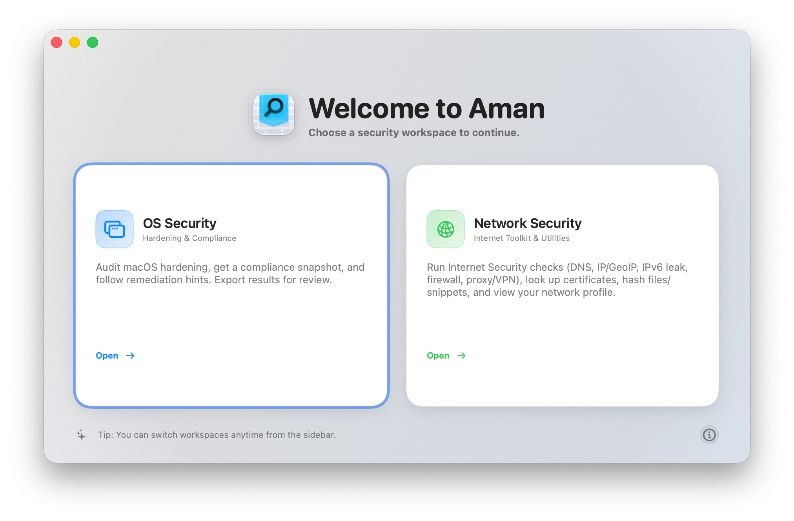
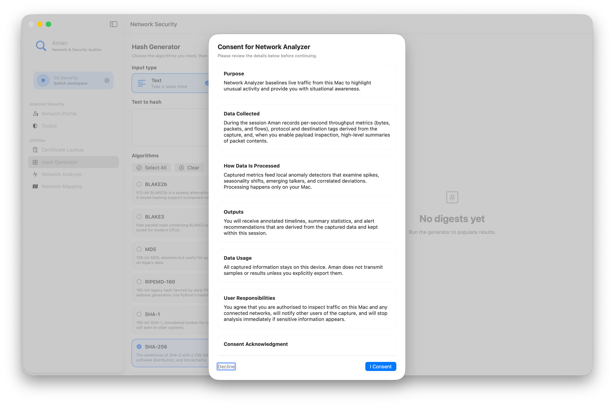
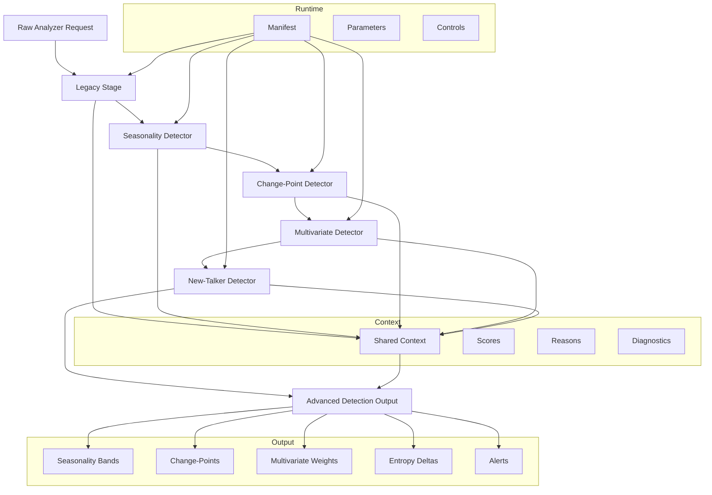
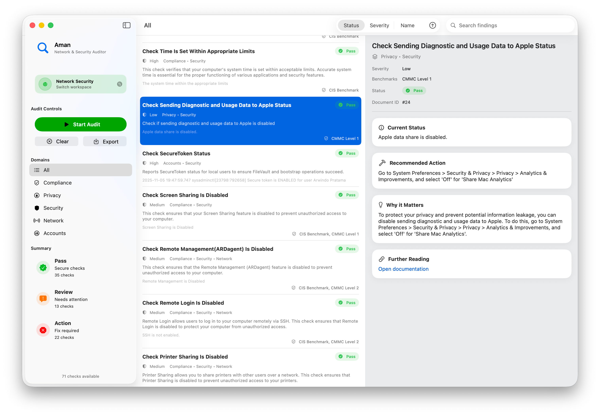

# Aman: macOS Network & Security Auditor



## Overview

Aman is a macOS Network & Security Auditor that merges a Swift-based audit engine with a Python-driven analytics layer. It performs system integrity checks, network exposure assessments, and behavior-based anomaly detection, all locally on-device. The auditor’s dual-layer design ensures detailed results without compromising privacy, making it a comprehensive tool for self-contained macOS security evaluation.

## Core Features

Aman combines structural system auditing with live network intelligence. It checks and validates configuration settings across **FileVault**, **SIP**, **Lockdown Mode**, **Gatekeeper**, and numerous other controls derived from CIS Benchmarks. The outcome of every scan is categorized under *Pass*, *Review*, or *Action*, accompanied by contextual explanations and one-click remediation references.

Beyond system auditing, Aman includes a real-time network module. It maps interfaces, discovers connected devices, and identifies exposed services through lightweight local probing. Network scans, topology exports, and consent-based intranet analysis form the backbone of its diagnostic capability. All actions operate under explicit user approval, ensuring compliance with privacy standards.

### Integrated Components

* **Configuration Auditing** - Performs comprehensive macOS configuration analysis, detecting deviations from security best practices.
* **Network Mapping** - Scans local interfaces, collects connection data, and generates visualized network topology exports.
* **Certificate and Hash Tools** - Built-in SSL certificate lookup and hash generator utilities powered by CryptoSwift.
* **Remediation Catalog** - Provides step-by-step mitigation guidance tied directly to detected issues.

## Advanced Detection Framework



Aman’s advanced detection engine, located in `Support/analyzer_core`, operates as a modular pipeline defined by `analyzer_pipeline.yaml`. This framework combines multiple detection models into a sequential process, each contributing specialized insights to a shared context.

### Detection Phases

1. **Legacy Stage** – Baseline heuristic evaluation using rule-based filters.
2. **Seasonality Detector** – Analyzes traffic patterns over time to determine normal periodic behavior.
3. **Change-Point Detector** – Identifies abrupt statistical shifts in network flow or packet rate distributions.
4. **Multivariate Detector** – Correlates data across multiple dimensions (throughput, latency, packet entropy) to detect composite deviations.
5. **New-Talker Detector** – Recognizes first-seen hosts or services, measuring entropy deltas and novelty within recent activity.

Each stage writes diagnostic data — scores, reasons, and statistical metrics — into a shared memory context, forming a cohesive analytical model. This produces an aggregated structure labeled `advancedDetection`. By applying rolling windows and vectorized operations, Aman achieves efficiency suitable for continuous on-device operation.




## OS Security Check Modules



**System Integrity and Firmware**

- Memastikan integritas firmware dan proses boot, termasuk perlindungan Secure Enclave/T2.
- Memverifikasi status System Integrity Protection (SIP).
- Memeriksa enkripsi penuh disk (FileVault) dan keterkaitan akun dengan akses enkripsi.

**Access Control and Authentication**

- Menegakkan penggunaan kredensial administrator untuk perubahan pengaturan sensitif.
- Memastikan perilaku login aman (misalnya auto‑login nonaktif, pesan peringatan ditampilkan).
- Mengevaluasi kebijakan kata sandi dan memastikan kompleksitas kata sandi yang memadai.
- Memastikan autentikasi diwajibkan setelah perangkat bangun dari mode tidur.
- Menilai dan menegakkan kebijakan penggunaan smartcard dan autentikasi multi‑faktor.

**Network and Remote Access**

- Memeriksa apakah firewall aktif dan dikonfigurasi dengan mode perlindungan yang tepat.
- Meninjau status akses jarak jauh (SSH, remote management) agar tidak terbuka tanpa kebutuhan.
- Membatasi layanan berbagi jaringan (internet sharing, file sharing, printer sharing) yang tidak diperlukan.
- Mengontrol kebijakan bangun dari jaringan (wake‑on‑LAN) agar tidak menjadi celah serangan.
- Menginventarisasi port yang sedang mendengarkan dan layanan terkait di perangkat.
- Melakukan pemindaian port internal di jaringan lokal sebagai bagian dari audit intranet.

**Software Update and Patch Management**

- Memastikan pembaruan sistem dan keamanan berjalan otomatis dan tidak tertunda berlebihan.
- Memverifikasi bahwa pembaruan penting dan pembaruan keamanan telah terpasang.
- Memeriksa status Rapid Security Response (RSR) pada macOS.
- Meninjau kebijakan penundaan pembaruan dan konsistensi pembaruan perangkat pendamping.

**System and Service Configuration**

- Memastikan Gatekeeper aktif dan tidak mudah dilewati.
- Menilai penerapan sandbox untuk aplikasi yang terpasang.
- Memeriksa pengaturan pembaruan dari App Store.
- Mengkaji konfigurasi fitur kontinu seperti Handoff dan Universal Control agar tidak menambah risiko.
- Meninjau status Lockdown Mode untuk skenario dengan kebutuhan keamanan tinggi.
- Menjamin konfigurasi jendela login sesuai kebijakan keamanan organisasi.

**Privacy and Telemetry**

- Meninjau pengaturan pengiriman data diagnostik dan log sensitif ke pihak ketiga.
- Memastikan pengaturan pelacakan aplikasi dan personalisasi iklan sejalan dengan kebijakan privasi pengguna.
- Mengelola integrasi “kecerdasan eksternal” seperti asisten digital dan layanan berbasis akun agar tidak mengumpulkan data berlebihan.
- Memastikan fitur asisten suara dan layanan sejenis diaktifkan hanya ketika benar‑benar dibutuhkan.

**Media and Peripheral Control**

- Mengendalikan visibilitas dan izin berbagi melalui AirDrop.
- Mengatur aktivasi layanan AirPlay agar tidak membuka permukaan serangan baru.
- Mengelola pengaturan Bluetooth dan kebijakan berbagi perangkat untuk meminimalkan risiko akses tidak sah.
- Membatasi berbagi media fisik seperti DVD atau CD.
- Meninjau eksposur layanan penemuan otomatis (seperti Bonjour) pada jaringan.

**Backup, Time, and Miscellaneous**

- Memastikan cadangan otomatis aktif dan terenkripsi dengan benar.
- Memeriksa sinkronisasi waktu dan integritas pengaturan tanggal/waktu.
- Menonaktifkan layanan lokal yang tidak diperlukan, seperti server web atau layanan file lama.
- Mengurangi perilaku antarmuka yang dapat melemahkan keamanan, seperti sudut layar yang mematikan screensaver.
- Meninjau kebijakan screensaver dan berbagi layar untuk menjaga kerahasiaan tampilan.
- Mengelola akses akun tamu dan sesi sementara agar tidak menjadi titik lemah.

**Malware and Threat Protection**

- Memeriksa apakah mekanisme perlindungan malware bawaan sistem aktif dan mutakhir.
- Menilai pengaturan browser terkait plugin, unduhan, dan penanganan berkas agar meminimalkan risiko infeksi.


## Architecture Overview

The Swift layer coordinates the entire workflow through key controllers such as `AuditCoordinator`, `NetworkMappingCoordinator`, and `PythonProcessRunner`. These components synchronize the macOS-side checks with the embedded Python analyzer, ensuring efficient communication between UI, logic, and analytics. The interface follows SwiftUI’s `NavigationSplitView` architecture, dividing the window into category navigation, audit results, and detailed remediation panels. Reports can be exported in both JSON and HTML formats for portability.

```mermaid
graph TD
    subgraph UI[SwiftUI Interface]
        U1[Landing & Navigation]
        U2[OS Security View]
        U3[Network Security View]
        U4[Network Topology Window]
        U5[About & Utility Screens]
    end

    subgraph Engine[Swift Engine Layer]
        E1[AuditCoordinator\n+ OS Security Checks]
        E2[NetworkSecurityViewModel\n+ Internet Security Toolkit]
        E3[NetworkMappingCoordinator\n+ Discovery · Topology · Port Scan]
        E4[Certificate & Hash Utilities]
        E5[PythonProcessRunner]
    end

    subgraph Analyzer[Python Analyzer Layer]
        P1[analyzer.py\nCLI Entry]
        P2[AnalyzerPipeline\n(manifest-driven)]
        P3[Detectors:\nLegacy · Seasonality · ChangePoint · Multivariate · NewTalker]
    end

    subgraph Outputs[Reports & Exports]
        O1[OS Audit Findings\n(HTML / JSON)]
        O2[Network Maps & Topology\nExport Files]
        O3[Analyzer Results\nadvancedDetection JSON · Logs]
    end

    %% UI drives engine
    U2 --> E1
    U3 --> E2
    U3 --> E4
    U4 --> E3

    %% Engine coordination
    E2 --> E3
    E2 --> E5
    E3 --> E5

    %% Python analyzer flow
    E5 --> P1 --> P2 --> P3

    %% Outputs
    E1 --> O1
    E3 --> O2
    P2 --> O3
```


## Build and Execution

Aman supports macOS Tahoe (26) or newer, requiring Xcode 16 and Python 3.9. After cloning the repository:

```bash
git clone https://github.com/anywindo/Aman.git
open Aman.xcodeproj
```

Build and run within Xcode or launch analyzer tests manually:

```bash
cd Support
python3 -m unittest discover -v
```

## License

Aman Network & Security Auditor is distributed under the MIT License. See the LICENSE file for details.

## Citation

```
@software{Aman2025,
  title  = {Aman: macOS Network & Security Auditor},
  author = {Pratama, Arwindo Sendy and contributors},
  year   = {2025},
  url    = {https://github.com/anywindo/Aman}
}
```
